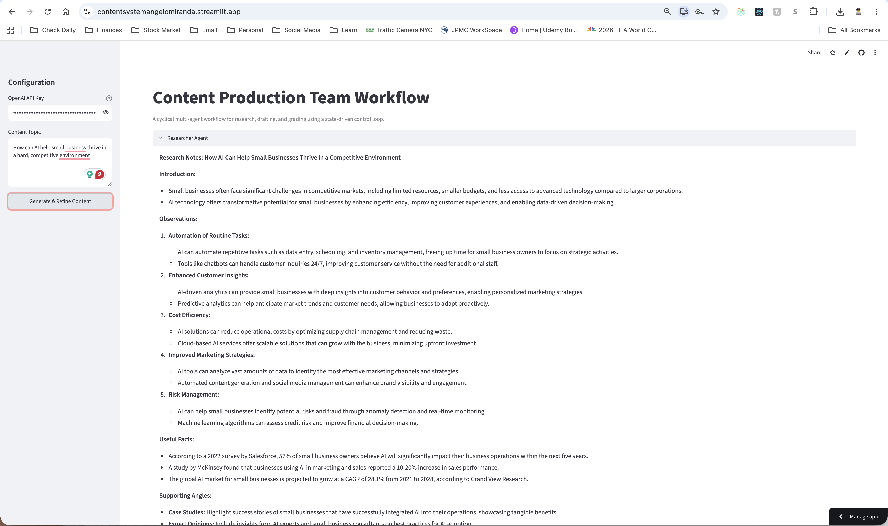

# Content Production Team

A production-ready Python application for orchestrating a multi-agent content workflow that researches a topic, drafts an article, grades the result, and refines it through a retry loop.

## Overview

This project is designed for real-world usage as a Streamlit application that can be deployed behind a web interface and connected to an LLM provider such as OpenAI. The workflow is intentionally modular so you can evolve it from a simple control loop into a more advanced orchestration pattern later.

## What the workflow does

The app follows a clear loop:

1. Researcher Agent gathers context and research notes.
2. Content Creator Agent writes or rewrites a blog-style draft.
3. Grader Agent evaluates the draft and returns a score plus actionable feedback.
4. If the score meets the target, the workflow ends.
5. If the score is below the target and the attempt limit has not been reached, the workflow retries.
6. If the maximum number of attempts is reached, the workflow stops and returns the latest draft.

## Why this is suitable for production

- Streamlit provides a simple web UI with minimal custom frontend work.
- The workflow state is centralized and typed for maintainability.
- The app already includes fallback logic so it can continue to run even when external LLM calls fail.
- The project structure is ready for containerization and deployment to cloud platforms.

## Project structure

```text
content-production-team/
├── app.py                 # Root entry point for Streamlit
├── README.md              # Project documentation
├── requirements.txt       # Runtime dependencies
├── pyproject.toml         # Python packaging metadata
├── .env.example           # Example environment variables
├── .gitignore             # Git ignore rules
├── Dockerfile             # Container build definition
├── .dockerignore          # Files excluded from container builds
├── docs/
│   └── DEPLOYMENT.md      # Production deployment guide
└── src/
    └── content_production_team/
        ├── __init__.py
        ├── app.py
        ├── config.py
        └── workflow.py
```

## Environment configuration

Create a local environment file from the example:

```bash
cp .env.example .env
```

Then fill in the values you need:

```env
OPENAI_API_KEY=your-api-key
OPENAI_MODEL=gpt-4o
CONTENT_MIN_SCORE=70
CONTENT_MAX_ATTEMPTS=3
```

## Local development

### 1. Create and activate a virtual environment

```bash
python3 -m venv .venv
source .venv/bin/activate
```

### 2. Install dependencies

```bash
pip install -r requirements.txt
```

### 3. Run the app locally

```bash
streamlit run app.py
```

The app will be available at the local Streamlit URL shown in the terminal.

## Streamlit Community Cloud deployment

This repository is already set up to deploy as a Streamlit app with the main entry point in [app.py](app.py).

### Deploy steps

1. Push the repository to GitHub.
2. Open Streamlit Community Cloud and create a new app from the repository.
3. Set the app main file to `app.py`.
4. Add the secret `OPENAI_API_KEY` in the Streamlit Cloud app settings.
5. Deploy the app.

The app will start with the default Streamlit configuration in [.streamlit/config.toml](.streamlit/config.toml).

## Container deployment

The project includes a Dockerfile for production-style container deployment.

### Build the image

```bash
docker build -t content-production-team .
```

### Run the container locally

```bash
docker run --rm -p 8501:8501 -e OPENAI_API_KEY=your-api-key content-production-team
```

## Production deployment options

The easiest deployment choices are:

| Platform                  | Best for                                       | Notes                                                  |
| ------------------------- | ---------------------------------------------- | ------------------------------------------------------ |
| Streamlit Community Cloud | Fastest path to a public app                   | Best for simple demos and MVPs                         |
| Render                    | Easy Docker or web service deployment          | Good balance of simplicity and production readiness    |
| Railway                   | Fast deployment with simple secrets management | Very convenient for small teams                        |
| Fly.io                    | Container-first deployment with global regions | Good if you want a containerized app with low friction |
| Azure App Service         | Enterprise-friendly deployment                 | Best if your organization already uses Azure           |
| AWS App Runner            | Managed container hosting                      | Good for AWS-native deployments                        |

For detailed instructions, see [docs/DEPLOYMENT.md](docs/DEPLOYMENT.md).

## Security considerations

Before deploying to production:

- store secrets such as API keys in platform secrets management
- avoid committing your .env file to source control
- use HTTPS and enforce authentication if the app will be shared internally or publicly
- review OpenAI usage and cost controls if the app is used heavily

## Dependencies

The main dependencies are:

- streamlit
- langchain-openai
- openai
- python-dotenv

## Demo screenshots



## See a demo

[Deployed Content Production System App](https://contentsystemangelomiranda.streamlit.app)
